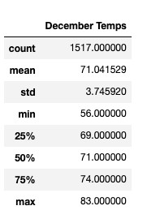

# surfs_up

## Overview of the analysis:

After a great vacation in Hawaii we discovered a newfound passion for surfing. We've been trying to come up with a plan that will let us not just return to Hawaii but live there forever. We finally come up with an idea  that we think is foolproof. A Surf n'Shake shop serving surfboards and ice cream to locals, tourists, and of course ourself. 
We have some savings but also we'll need some real investor backing to get this off the ground. We found one and he is very exited, but he is worried about the weather and how it would affect the business. However. he didn't ask for any weather analysis and early venture was rained out of existence. He ask if we can run some analysis on weather dataset he has from the very island where we'd like to open our shop: The beautiful Oahu. 

After all code we run, W. Avy likes our analysis, but he wants more information about temperature trends before opening the surf shop. Specifically, he wants temperature data for the months of June and December in Oahu, in order to determine if the surf and ice cream shop business is sustainable year-round.

## Results:

First we converted all temperatures from June and December to a lists, then we created a DataFrames from those lists and finaly we could calculate a summary statistics for June and December temperatures to compare.

 

So, according to our statistics we can highlight three major points from the two analysis deliverables:

- The good news that the average temperatures in summer and winter tends to be pretty close and it is warm, definetely good for surfing and ice cream!

- Unfortunately, in December it can get very cold. So, probably you would not enjoy your surfing.

- The highest temperatures in both months appear to be similar and ideal for surfing.

## Summary:

Overall, our analysis demonstrates that the beautiful island of Oahu experiences ideal surfing weather throughout the entire year. The temperature is almost the same all the time and perfect for our business. 
However, for full confidence in the success of the business I would run to more queries:

- In order to determine how frequently that minimum temperature tends to occur, I would count the number of cold days in December and June. For those purposes, I would filter our created lists of temperatures using the code in a manner similar to this: 

- Also, very important to check the precipitation amount in the analyzed months. What if tere are a lot of storms going on during those months? So, I would defenetely analyse that data.